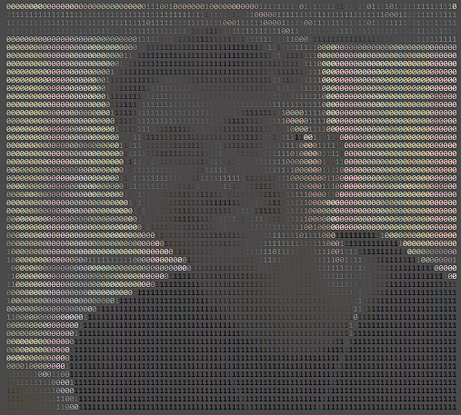
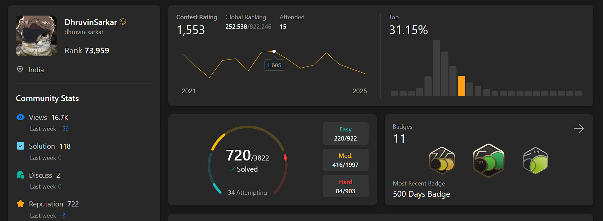

---

  <picture>
    <source media="(prefers-color-scheme: dark)" srcset="https://raw.githubusercontent.com/dhruvin-sarkar/dhruvin-sarkar/output/github-snake-dark.svg" />
    <source media="(prefers-color-scheme: light)" srcset="https://raw.githubusercontent.com/dhruvin-sarkar/dhruvin-sarkar/output/github-snake.svg" />
    
  </picture>

---

# 👋 Hey

I'm an AI and Design Thinking student in the 11th grade, passionate about turning ideas into crafted digital experiences. Technology and electronics have always been a part of my life — both my father and grandfather worked with tech, so I was surrounded by computers, PCBs, and code from as far back as I can remember. My first experience with programming was when my dad taught me C and C++ in the 3rd grade, when I was just 8 years old. I deeply value UI/UX, and I strive to build products that not only function well but also deliver memorable, meaningful experiences for users.I'm also deeply committed to improving my problem-solving and coding skills — especially through competitive programming and LeetCode

While some might say I'm interested in too many things, I see it as creative fuel. I'm a passionate gamer — from FPS games to roguelikes and simulators — and I explore web development, game development, PCB work, and PC modding. Beyond tech, I enjoy car modding, archery, and diving into anime, manhwa, and manga especially music. All of these interests inspire how I think, create, and solve problems, helping me bring fresh perspectives to everything I build.

---

## �️ Tech Stack & Tools

### 💻 Languages

  
  
  
  
  
  
  
  
  
  
  
  
  

   💻 Operating Systems

  
  
  
  
  
  
  
  
  

   🎨 Frontend & Design

  
  
  
  
  
  
  
  

    🚀 Frameworks

  
  
  
  
  
  
  
  
  
  
  
  

    ⚙️ Backend & Databases

  
  
  
  

  🎮 Game Development

  
  
  
  
  

    🔧 Hardware & Electronics

  
  

   🛠️ Tools & DevOps

  
  
  
  
  

---

## 📅 Contribution Calendar

  

---

## 📈 Coding Habits

---

  

---

## 💻 LeetCode Stats

  

---

## 🎵 Spotify Activity

  <table>
    <tr>
      <td width="50%" align="center">
        
      </td>
      <td width="50%" align="center">
        
      </td>
    </tr>
  </table>

---
