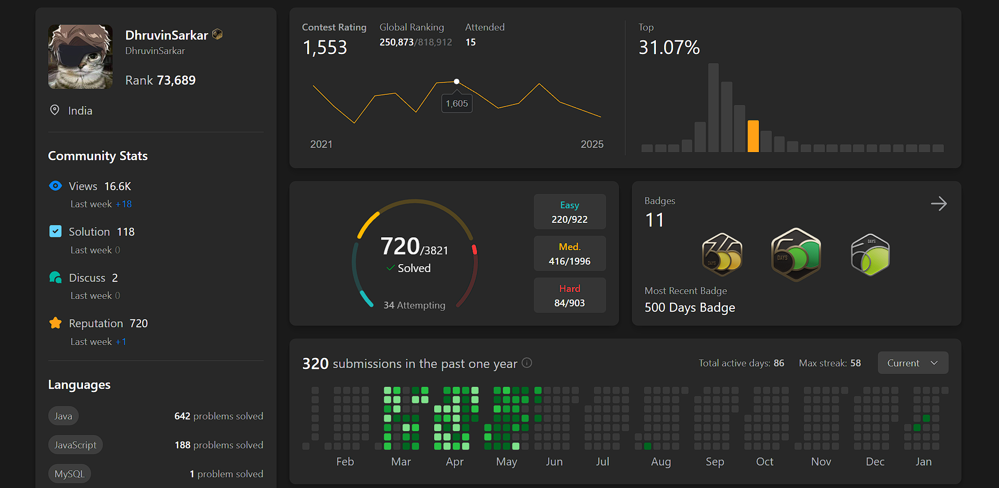

# 👋 Hey

I'm an AI and Design Thinking student in the 11th grade, passionate about turning ideas into crafted digital experiences. Technology and electronics have always been a part of my life — both my father and grandfather worked with tech, so I was surrounded by computers, PCBs, and code from as far back as I can remember. My first experience with programming was when my dad taught me C and C++ in the 3rd grade, when I was just 8 years old. I deeply value UI/UX, and I strive to build products that not only function well but also deliver memorable, meaningful experiences for users.I'm also deeply committed to improving my problem-solving and coding skills — especially through competitive programming and LeetCode

While some might say I'm interested in too many things, I see it as creative fuel. I'm a passionate gamer — from FPS games to roguelikes and simulators — and I explore web development, game development, PCB work, and PC modding. Beyond tech, I enjoy car modding, archery, and diving into anime, manhwa, and manga especially music. All of these interests inspire how I think, create, and solve problems, helping me bring fresh perspectives to everything I build.

---

## 📅 Contribution Calendar

---

## 📈 Coding Habits

---

## 💻 LeetCode Stats

  

---

## 🎵 Spotify Activity

  

---

## 🎮 Let's play Pokémon together

 
  
 
  

<em>Click buttons above to issue new gamepad input, refresh this page to view newest game screen to interact</em>

