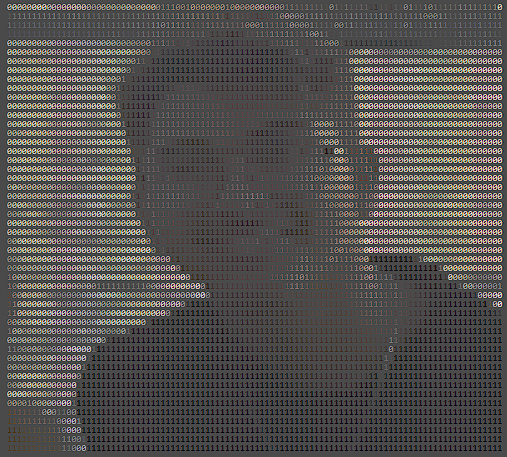
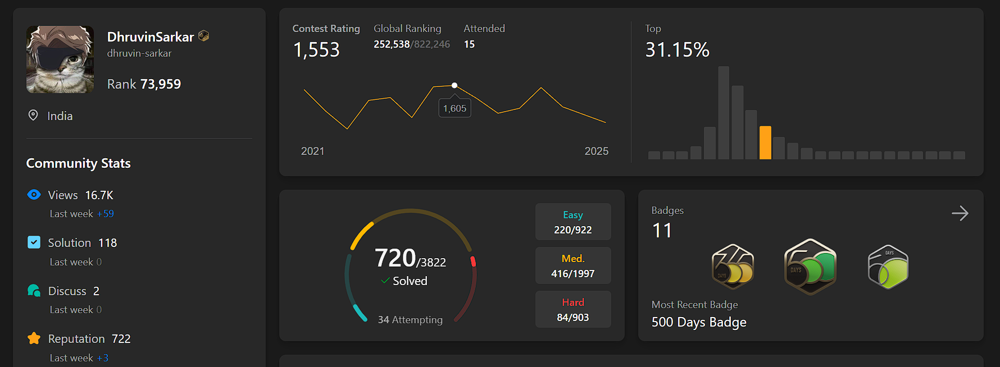

---

  <picture>
    <source media="(prefers-color-scheme: dark)" srcset="https://raw.githubusercontent.com/dhruvin-sarkar/dhruvin-sarkar/output/github-snake-dark.svg" />
    <source media="(prefers-color-scheme: light)" srcset="https://raw.githubusercontent.com/dhruvin-sarkar/dhruvin-sarkar/output/github-snake.svg" />
    
  </picture>

---

## 🎮 Let's Play Pokémon Together

  <table>
    <tr>
      <td width="20%" align="right" valign="middle">
        <table>
          <tr>
            <td></td>
            <td></td>
            <td></td>
          </tr>
          <tr>
            <td></td>
            <td></td>
            <td></td>
          </tr>
          <tr>
            <td></td>
            <td></td>
            <td></td>
          </tr>
        </table>
      </td>
      <td width="40%" align="center" valign="middle">
        
      </td>
      <td width="40%" align="left" valign="middle">
        
        
          
        
        
          
        <em>Click buttons • Refresh to see updates</em>
      </td>
    </tr>
  </table>

---

# 👋 Hey

I’m an AI and Design Thinking student in the 11th grade. Technology and electronics have always been part of my life, I grew up surrounded by computers, PCBs, and tech wayyy before I even knew what they were. My dad taught me C and C++ at the age of 8, and that curiosity turned into a obsession with understanding how things work.

I’m interested in a lot of things, and I see that as more of an advantage rather than the latter. I’m a competitive FPS and roguelike enjoyer, I love mechanically demanding games, I explore web development, game development, hardware tinkering, PCB work, and PC modding, and I love and I mean LOVE Linux from early usage of Ubuntu and Fedora to daily-driving Arch Linux, where I’ve spent years ricing, configuring, breaking, and rebuilding my system through dotfiles, window managers, and custom workflows. I’m a docs-first,  trial and error, type person that tend to obsess over details and polish. other than tech stuff I’m into car modding, archery, music, and anime/manga/manhwa.

---

## Tech Stack & Tools

  Languages

  
  
  
  
  
  
  

  Frontend & Design

  
  
  
  
  
  
  

  Frameworks

  
  
  
  
  
  
  
  

  Backend & Databases

  
  
  
  
  
  
  

  Game Development

  
  
  
  
  
  

  Hardware & Electronics

  
  

  Tools & DevOps

  
  
  
  

---

##  Contribution Calendar

  

---

##  Coding Habits

---

  <table>
    <tr></tr>
      <td width="40%" align="center" valign="top">
        
      </td>
      <td width="60%" align="center" valign="top">
        <h3> GitHub Streak</h3>
        
      </td>
    </tr>
  </table>

---

##  LeetCode Stats

  

---

##  Spotify Activity

  <table>
    <tr>
      <td width="50%" align="center">
        
      </td>
      <td width="50%" align="center">
        
      </td>
    </tr>
  </table>

  

---
